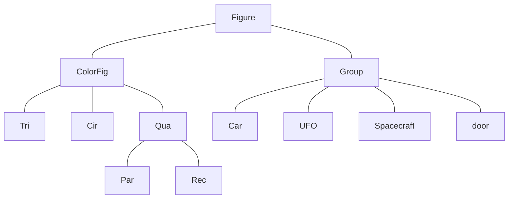

# Project 3 (Group 03)

The contribution: the project 3 is mainly completed by us five we together wrote the project with fully preparation and discussion. we discussed the classes, the heritance, and the functions together, we first wrote a clear structure of what we would do steps by steps and distributed the tasks to individuals first, then we together arrange the parts and fully get it polished and workable.
- Wang yutong contributes to the version one mainly, she provides us with great organization and clear class arrangement. 
- Mao xinyue follows the whole part of the milestones and offers the strong connection between the milestones and the fitness of each part.
- Zhang haoran constructs the pms mostlly and write the code with thorough consideration of the all the shapes and inheritances.And also write the turn, zoom, changecolor in ipa. 
- Ye zi organizes the tasks properly and write the code of the funcitons and movements. 
- Xu ziyu writes the readme file and the the graphes, also the milestone 2 partly.
The debug part is only done by ZhangHaoran and Xuziyu.
## HIGHLIGHTS:
- In pms , we create different type of space, and record where the cars parked in.
- In ipa, we use a struct containing the direction vector and the rotate angle to guide the car to the space, to make it move more smoothly. 
## Inheritance

## pms
### Basic Information 
- The space has a car type, which means only the car type is the same as the space type can it parked in it.
- The parkinglot has randomly generate 3-7 floors, with each floor randomly equipped with 3-15 spaces.
- The vehicles' start times are randomly generated with current time, and the end times are randomly generated with the start times.
- The sum of the car is random, from 30 to 59; the car type is randomly decided as well.(Car fee is defined:Van 20 per t;Car 10; Motobike 5;Bike 2).
- each space is connect to the car with a pointer, so that we can find the car related to certain space.
### Process
- run the program, and output the parkinglot which is gengerated randomly.
- the car goes in the space with the message "car x goes to x floor x spot." if find any space meet the requirement, or it will output "Sorry, there are no spots for the car x".
- when the car get out of the parkinglot, it will print a ticket with car_type,in_time,out_time,and the car_fee.
## ipa
### Basic Information & Process
- when run the code, input a number between 7 and 10. The parking Lot is like the downwards.
   ________________________
       | 0 | 1 | 2 | 3 | 4 |
    

         --------------
    

       | 5 | 6 | 7 | 8 | 9 |
    ________________________
- All the functions are completed, including the rotate, zoom , turn , and change color.
  